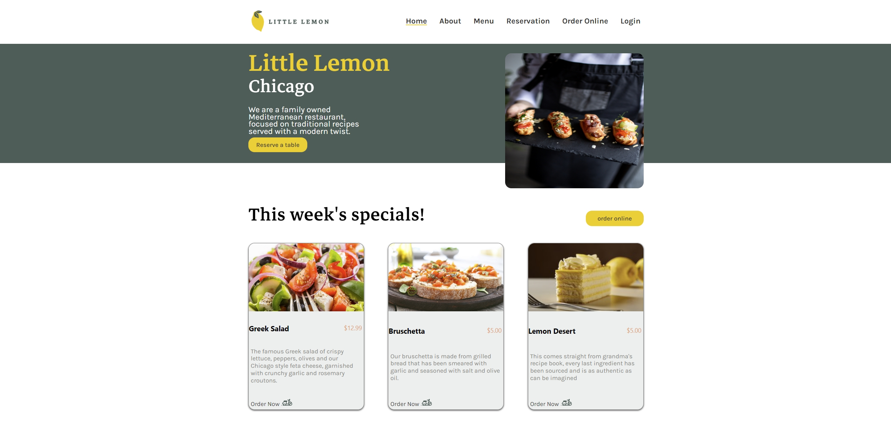
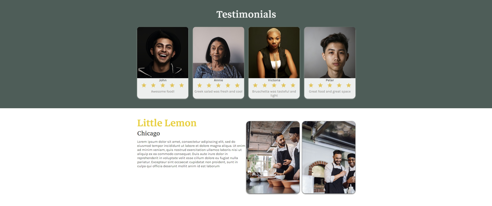
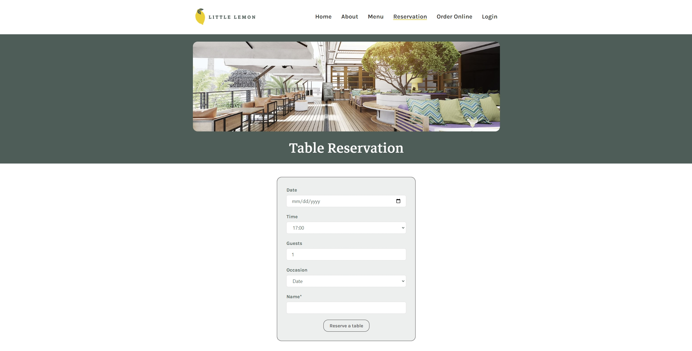

# Capstone Project - Meta Front-End Developer Professional Certificate

This repository contains the capstone project for the course "Meta Front-End Developer Professional Certificate". The project consists of a web application with a home page and a reservation page.

## Home Page





The home page showcases the main features and highlights of the web application. It is designed to provide an overview and attract users to explore further.

## Reservation Page




The reservation page allows users to make reservations for a specific service or event. It provides a user-friendly interface to enter necessary details and submit the reservation request.

## Installation

1. Clone the repository:

    ```shell
    git clone https://github.com/your-username/project.git
    ```

2. Navigate to the project directory:

    ```shell
    cd Meta-FrontEnd-Capstone-Project

    ```

3. Install the required dependencies:

    ```shell
    npm install

    ```

4. Start the development server:

    ```shell
    npm start

    ```

5. Open a web browser and visit http://localhost:3000 to access the application.
